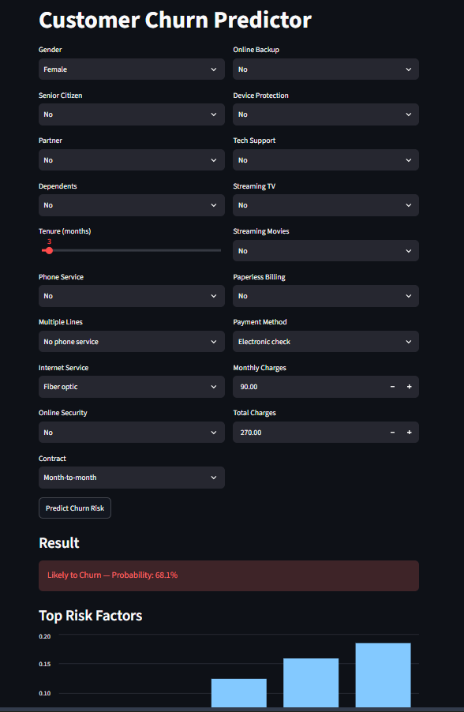
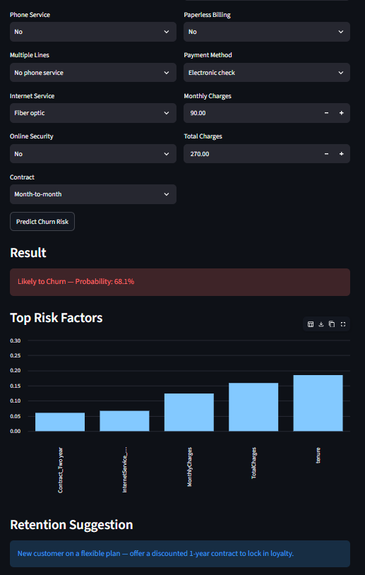

# Customer Churn Prediction


## Project Overview

This project predicts whether a telecom customer is likely to churn (cancel their subscription), using customer account and service data. It includes a full ML pipeline (EDA, preprocessing, model training and comparison), a REST API to serve predictions, and a dashboard for non-technical users to check churn risk and get retention suggestions.

## Business Problem Statement

Customer churn directly impacts recurring revenue, and acquiring a new customer is generally more expensive than retaining an existing one. For a telecom provider, being able to flag at-risk customers *before* they cancel allows the retention team to intervene proactively (discounts, contract upgrades, support outreach) instead of reacting after the customer has already left.

This project treats churn prediction as a binary classification problem: given a customer's account details and service usage, predict whether they are likely to churn, and surface which factors are driving that risk.

## Dataset Description

**Source:** [Telco Customer Churn dataset (Kaggle)](https://www.kaggle.com/datasets/blastchar/telco-customer-churn)

- **Rows:** 7,043 customers
- **Columns:** 21 features + target (`Churn`)
- **Target distribution:** ~73% No churn, ~27% Yes churn (imbalanced)

**Feature groups:**
- **Demographics:** gender, senior citizen, partner, dependents
- **Account info:** tenure (months), contract type, paperless billing, payment method
- **Services:** phone service, multiple lines, internet service, online security, online backup, device protection, tech support, streaming TV, streaming movies
- **Charges:** monthly charges, total charges

## Data Preprocessing Steps

1. **`TotalCharges` type fix** — stored as text with 11 blank entries; converted to numeric. All 11 blanks belonged to customers with `tenure = 0` (new customers not yet billed), so they were filled with `0` rather than dropped or imputed with a mean.
2. **Dropped `customerID`** — unique identifier, not predictive.
3. **Target encoding** — `Churn` mapped from Yes/No to 1/0.
4. **Categorical encoding** — one-hot encoding (`pd.get_dummies`) applied to all categorical columns.
5. **Train/test split** — 80/20 split, **stratified** on the target to preserve the churn ratio in both sets (important given the class imbalance).
6. **Feature scaling** — `StandardScaler` applied to `tenure`, `MonthlyCharges`, `TotalCharges` (needed for Logistic Regression; tree-based models don't require it, but the same scaled set was reused for consistency in the API/dashboard pipeline).

## Machine Learning Approach

Three classification models were trained and compared, spanning a linear baseline and two tree-ensemble methods:

- **Logistic Regression** — linear baseline, trained on scaled features
- **Random Forest** — bagged ensemble of decision trees
- **Gradient Boosting** — sequential boosted ensemble

Because the dataset is imbalanced (~27% churn), models were evaluated primarily on **ROC-AUC** rather than raw accuracy, since accuracy alone can look misleadingly high on imbalanced data (a model predicting "No churn" for everyone would already score ~73% accuracy).

## Model Comparison Results

| Model | Accuracy | Precision | Recall | F1 | ROC-AUC |
|---|---|---|---|---|---|
| Random Forest | 0.806 | 0.669 | 0.535 | 0.594 | **0.844** |
| Logistic Regression | 0.806 | 0.659 | 0.559 | 0.605 | 0.842 |
| Gradient Boosting | 0.797 | 0.651 | 0.508 | 0.571 | 0.838 |

**Random Forest** was selected as the final model (best ROC-AUC).

## Performance Evaluation Metrics

- **Accuracy** — overall correct predictions (less reliable here due to class imbalance)
- **Precision** — of customers predicted to churn, how many actually did (relevant for not wasting retention budget on false positives)
- **Recall** — of customers who actually churned, how many were caught (relevant for not missing at-risk customers)
- **F1 Score** — balance between precision and recall
- **ROC-AUC** — the model's ability to rank churners above non-churners across all thresholds; used as the primary metric here

The notebook (`churn_prediction.ipynb`) also includes a confusion matrix, ROC curve, and a feature importance chart for the final model. Top churn drivers identified: **tenure, contract type, monthly charges, and internet service type.**

## API Documentation

FastAPI service (`main.py`) exposing a single prediction endpoint.

**Base URL (local):** `http://127.0.0.1:8000`

### `GET /`
Health check.

**Response:**
```json
{ "status": "ok", "message": "Churn Prediction API is running" }
```

### `POST /predict`
Takes a customer's details and returns churn prediction + probability.

**Request body:**
```json
{
  "gender": "Female",
  "SeniorCitizen": 0,
  "Partner": "Yes",
  "Dependents": "No",
  "tenure": 1,
  "PhoneService": "No",
  "MultipleLines": "No phone service",
  "InternetService": "DSL",
  "OnlineSecurity": "No",
  "OnlineBackup": "Yes",
  "DeviceProtection": "No",
  "TechSupport": "No",
  "StreamingTV": "No",
  "StreamingMovies": "No",
  "Contract": "Month-to-month",
  "PaperlessBilling": "Yes",
  "PaymentMethod": "Electronic check",
  "MonthlyCharges": 29.85,
  "TotalCharges": 29.85
}
```

**Response:**
```json
{
  "churn_prediction": "Yes",
  "churn_probability": 0.5383
}
```

Interactive API docs (Swagger UI) are auto-generated by FastAPI at `/docs` once the server is running.

## Setup Instructions

**Requirements:** Python 3.9+, and the dataset CSV in the project root.

**1. Run the notebook first** (generates the model artifacts used by the API and dashboard)
```
pip install pandas numpy matplotlib seaborn scikit-learn joblib jupyter
jupyter notebook churn_prediction.ipynb
```
Run all cells. This produces `churn_model.pkl`, `scaler.pkl`, and `model_columns.pkl`.

**2. Run the API**
```
pip install -r requirements.txt
uvicorn main:app --reload
```
Visit `http://127.0.0.1:8000/docs` to test `/predict` interactively.

**3. Run the dashboard**
```
streamlit run app.py
```
Opens automatically in your browser.

## Application Screenshots

**Dashboard input form:**



**Prediction result, risk factors, and retention suggestion:**



## Project Structure

```
churn_project/
├── churn_prediction.ipynb
├── main.py
├── app.py
├── requirements.txt
├── churn_model.pkl
├── scaler.pkl
├── model_columns.pkl
├── WA_Fn-UseC_-Telco-Customer-Churn.csv
└── screenshots/
    ├── dashboard_form.png
    └── dashboard_result.png
```

## Future Work

The following were out of scope given the project timeline and are not implemented:

- **Hyperparameter tuning** (GridSearch/RandomizedSearch) — current models use reasonable defaults
- **Docker containerization** — the app currently runs via `uvicorn`/`streamlit` directly
- **Cloud deployment** — currently runs locally only
- **A learned recommendation engine** — the dashboard currently uses simple rule-based retention suggestions rather than a separately trained recommendation model
